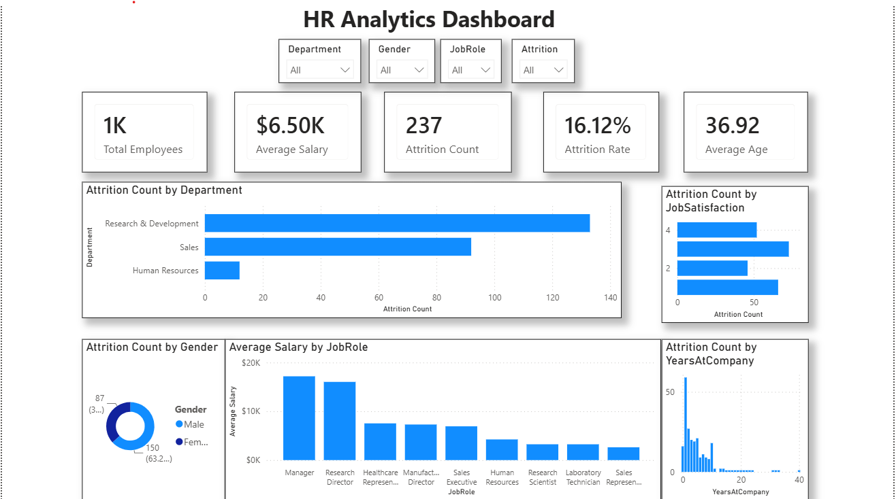

# HR Analytics Dashboard
## Overview
This project is an HR Analytics Dashboard built in Power BI using employee data. The dashboard helps analyze workforce trends and employee attrition through interactive visualizations and KPI tracking.
## Tools Used
* Power BI
* Microsoft Excel
## Key Metrics
* Total Employees
* Attrition Count
* Attrition Rate
* Average Age
* Average Salary
## Dashboard Analysis
The dashboard provides insights into:
* Employee attrition by department
* Attrition by job role
* Education field analysis
* Gender-wise employee distribution
* Workforce demographic
## Key Insights
* Identified departments with higher attrition rates.
* Compared attrition across different job roles.
* Analyzed employee distribution based on education and gender.
* Highlighted workforce trends that can support HR planning.
## Files Included
* HR_Analytics_Dashboard.pbix
* Dataset
* Dashboard Screenshot
## Dashboard Preview

## Skills Demonstrated
Power BI, Data Visualization, Dashboard Development, KPI Reporting, Data Cleaning, Data Analysis, Business Intelligence

